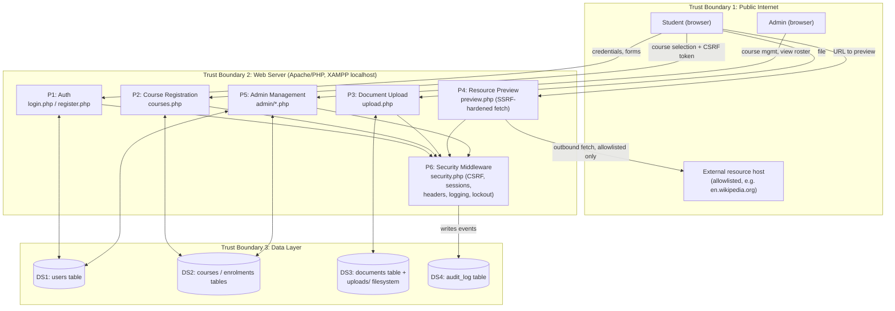

# Task 1: STRIDE Threat Model and Risk Assessment
### Student Registration Web Application - IFT542 Practical Assignment

---

## 1. Data-Flow Diagram

Processes, data stores, external entities and trust boundaries are drawn
from the app as actually built (see `public/`, `includes/security.php`,
`config/db.php`). Render this with any Mermaid-compatible viewer (GitHub,
VS Code Mermaid extension, mermaid.live) or paste the block into an
artifact/diagramming tool - screenshot the rendered output for your PDF
report.

**Trust boundaries:**
1. **Public Internet → Web Server**: anything crossing this boundary is
   untrusted input (form fields, files, URLs, cookies).
2. **Web Server → Data Layer**: only reached through parameterized
   queries via `config/db.php`; the web tier is the sole intermediary.
3. **Web Server → External Host** (Process P4 only): the one place this
   app makes outbound requests on the user's behalf - the SSRF attack
   surface.

---

## 2. STRIDE Worksheet (8 threats - exceeds the 6 required)

| # | STRIDE Category | Threat (application-specific) | Affected Flow/Asset |
|---|---|---|---|
| T1 | **S**poofing | Credential stuffing / brute-forcing a student's login using leaked password lists | Student → P1 (Auth) → DS1 |
| T2 | **S**poofing | Session hijacking via a stolen/predictable session cookie | Any authenticated flow (P1-P5) |
| T3 | **T**ampering | Attacker tampers with the `course_id` POST field to enrol in a course they shouldn't have access to, or replays a captured request | Student → P2 (Course Registration) → DS2 |
| T4 | **R**epudiation | A student denies registering for a course, or an admin denies deleting a course, with no record to prove otherwise | P2/P5 → DS2 |
| T5 | **I**nformation Disclosure | SQL injection in an unparameterized login query leaks the entire `users` table (see `vulnerable-examples/login_vulnerable.php`) | Student → P1 → DS1 |
| T6 | **I**nformation Disclosure | Verbose PHP errors/stack traces or DB error strings shown directly to the browser in a misconfigured (debug-on) deployment | Any process → browser |
| T7 | **D**enial of Service | Unrestricted file upload size/count exhausts server disk space, or repeated login attempts exhaust DB connections | Student → P3 (Upload) / P1 (Auth) |
| T8 | **E**levation of Privilege | A student directly requests `/admin/*.php` (forced browsing) to reach course-management or roster functions reserved for admins | Student → P5 (Admin) → DS1/DS2 |
| T9 | (bonus) **T**ampering / SSRF | Attacker submits an internal/metadata URL to the resource-preview feature to make the server fetch internal-only resources | Student → P4 (Preview) → internal network |

---

## 3. Risk Register (Likelihood x Impact, 1-5 scale each)

Scored **before** the controls in this project were applied (i.e. the
risk the prototype started with), then **after**.

| # | Threat | L | I | Risk (L×I) | Priority | Control Applied | Residual L | Residual I | Residual Risk |
|---|---|---|---|---|---|---|---|---|---|
| T5 | SQL injection (login) | 4 | 5 | **20** | 1 | Prepared statements, `ATTR_EMULATE_PREPARES` off (`config/db.php`, `login.php`) | 1 | 5 | 5 |
| T8 | Broken access control / admin bypass | 3 | 5 | **15** | 2 | `require_role('admin')` guard on every `admin/*.php`; logged as `ACCESS_DENIED` | 1 | 4 | 4 |
| T9 | SSRF via resource preview | 3 | 4 | **12** | 3 | Scheme + host allowlist, self-resolved IP check blocking private/loopback/metadata ranges, no redirects (`preview.php`) | 1 | 3 | 3 |
| T6 | Verbose error/debug disclosure | 3 | 4 | 12 | 4 | `APP_DEBUG` env flag gates `display_errors`; DB exceptions never echoed (`bootstrap.php`, `db.php`) | 1 | 3 | 3 |
| T1 | Credential stuffing | 4 | 4 | 16 | 5 | Argon2id hashing + 5-attempt/15-min lockout (`security.php`) | 2 | 3 | 6 |
| T3 | Tampering with course_id / CSRF | 3 | 3 | 9 | 6 | Anti-CSRF token required on every state-changing POST (`csrf_field()`/`require_csrf()`) | 1 | 2 | 2 |
| T7 | DoS via unrestricted upload | 3 | 3 | 9 | 7 | 2MB size cap, single-file-per-request, content-type check (`upload.php`) | 2 | 2 | 4 |
| T2 | Session hijacking | 2 | 4 | 8 | 8 | HttpOnly + SameSite=Lax cookies, session regeneration on login (`security.php`) | 1 | 3 | 3 |
| T4 | Repudiation of actions | 2 | 3 | 6 | 9 | `audit_log` table records who/what/when for every sensitive action (`log_event()`) | 1 | 2 | 2 |

*(Risk = Likelihood × Impact, both rated 1-5. Priority ranked by original
risk score, highest first.)*

---

## 4. Top Three Priority Risks - Justification

**1. SQL Injection (T5) - original risk 20, residual 5.**
Highest possible impact (full authentication bypass and complete
disclosure of the `users` table, including password hashes) combined with
high likelihood in an unparameterized prototype, since SQLi payloads
against login forms are among the most commonly automated attacks against
web apps. Fixed with server-side prepared statements so user input can
never alter query structure. Residual risk of 5 is **accepted**: it
reflects the small remaining possibility of a *new*, not-yet-audited query
being added later without parameterization - mitigated going forward by
code review discipline and the automated test in
`tests/run_tests.php` that specifically re-tests the `' OR '1'='1'`
payload on every run.

**2. Broken Access Control / Elevation of Privilege (T8) - original risk
15, residual 4.**
A prototype without server-side role checks lets any authenticated (or
even unauthenticated, if session checks are also missing) user reach
admin functionality just by guessing the URL - a very common real-world
finding (OWASP's #1 category in recent years). Impact is severe: full
control over courses and visibility into the student roster. Fixed with a
`require_role()` guard on every admin page, backed by a database-verified
session role rather than a client-trusted flag. Residual risk of 4 is
**accepted**: it accounts for the risk of a future new admin page being
added without the guard, which is why every admin file was written to
lead with `require_role('admin')` as the very first line as an explicit,
grep-able convention.

**3. SSRF via Resource Preview (T9) - original risk 12, residual 3.**
Selected over the tied Information Disclosure risk (T6) because SSRF has a
more severe worst case in most real deployments: an unrestricted
"fetch this URL for me" feature can be used to reach cloud metadata
endpoints or internal-only services that are otherwise unreachable from
the internet, turning a minor feature into a pivot point into the internal
network. Fixed with a scheme allowlist, a strict hostname allowlist,
self-resolved DNS with private/loopback/metadata IP-range rejection, and
disabled redirects (`preview.php`). Residual risk of 3 is **accepted**: a
determined attacker could still attempt DNS-rebinding style tricks against
the allowlist in a more complex deployment; full elimination would require
a network-level egress proxy, which is out of scope for a localhost
teaching prototype but is noted as a recommended follow-up control.

---

## 5. Notes for your report

- Cross-reference this file with `README.md`'s "Security controls
  implemented" table for a one-line pointer from each threat to its fix.
- Screenshot the rendered Mermaid diagram for the PDF (mermaid.live or the
  VS Code/GitHub renderer both work well).
- Your STRIDE worksheet requirement (≥6 threats, all 6 categories) is
  satisfied by T1-T8 above; T9 is included as bonus SSRF coverage since it
  ties directly into Task 3's SSRF control.
